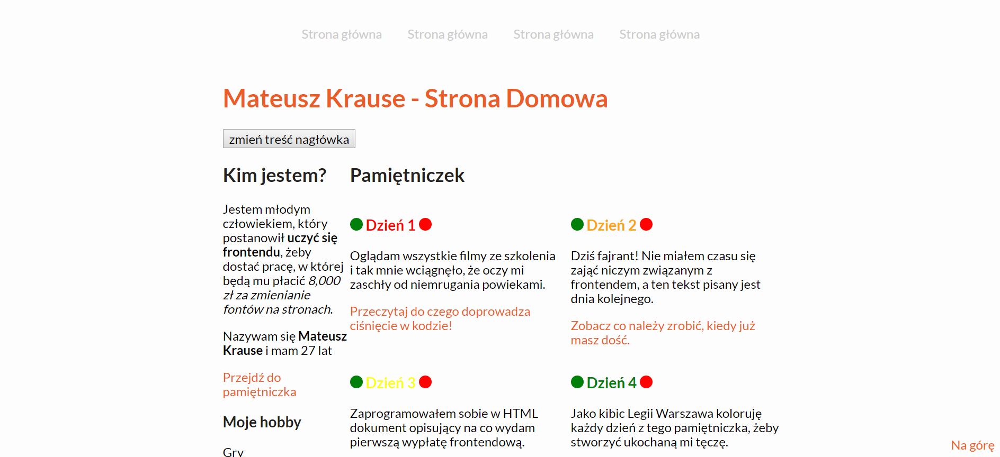

# Mój homepage

Zapraszam na moją stronę: [Homepage](https://mateuszkrause.github.io/homepage-gulp)

## Jak uruchomić moją stronę lokalnie

Aby uruchomić moją stronę lokalnie wykonaj poniższe polecenia:

`npm install -g gulp-cli`

`npm install`

`gulp`

To publish your page using github pages use `npm run deploy`
